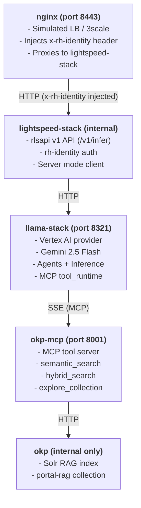

# RLS Backend - RHEL Lightspeed RAG Service

**Version:** 0.1.0

Production backend for the RHEL Lightspeed Command Line Assistant with OKP (Solr) RAG system.

## Overview

This service provides:
- **Server mode architecture**: lightspeed-stack connects to llama-stack (port 8321) via HTTP
- **rlsapi v1 compatibility**: Supports `POST /v1/infer` endpoint with the same interface as the legacy rlsapi service
- **MCP tool_runtime on llama-stack**: MCP tools are registered natively with llama-stack's `tool_runtime` API, enabling the LLM agent to call tools directly during inference
- **OKP RAG architecture**: Solr-backed semantic/hybrid search (errata, CVEs, RHEL docs) via MCP server
- **rh-identity authentication**: Validates x-rh-identity headers with rhel entitlement checks
- **Vertex AI backend**: Uses Google's Gemini 2.5 Flash for LLM inference

## Architecture



## Prerequisites

1. **Container tools**:
   - \`podman\` and \`podman-compose\` installed
   - Access to \`registry.redhat.io\`: Run \`podman login registry.redhat.io\` before deployment
   - Access to \`images.paas.redhat.com\`: VPN required for OKP Solr image. Run \`podman login images.paas.redhat.com\` if prompted.

2. **Google Cloud credentials**:
   - GCP service account JSON file with Vertex AI API enabled
   - Project ID and region (e.g., \`us-central1\`)

3. **Git submodules**:
   - Clone with \`--recurse-submodules\`, or run \`git submodule update --init\` after cloning
   - **Note**: \`okp-solr-rag-providers\` requires VPN to access \`gitlab.cee.redhat.com\`

## Quick Start

1. **Configure environment**:
   \`\`\`bash
   cp .env.example .env
   # Edit .env and set:
   # - VERTEX_AI_PROJECT=your-gcp-project-id
   # - VERTEX_AI_LOCATION=us-central1
   # - GCP_CREDENTIALS_PATH=/path/to/google-credentials.json (host path)
   \`\`\`

2. **Initialize submodules** (requires VPN for okp-solr-rag-providers):
   \`\`\`bash
   git submodule update --init --recursive
   \`\`\`

3. **Start the stack**:
   \`\`\`bash
   podman compose up -d
   \`\`\`

4. **Wait for healthy containers** (first run takes 5-10 minutes to build MCP image and download embedding model; subsequent starts take ~60 seconds):
   \`\`\`bash
   podman compose ps
   # All 4 containers should show "healthy" status
   # (nginx, lightspeed-stack, llama-stack, okp-mcp, okp)
   \`\`\`

5. **Test inference through the load balancer** (no auth header needed):
    \`\`\`bash
    curl -s -X POST http://localhost:8443/v1/infer \\
      -H "Content-Type: application/json" \\
       -d '{"question": "What are the new features in RHEL 10?"}'
    \`\`\`
    The LLM will automatically use OKP MCP tools to retrieve relevant documentation
    before generating its answer. RHEL 10 is past the LLM's training cutoff, so
    accurate answers with citations prove the RAG pipeline is working.

6. **Verify MCP tool calls**:
    \`\`\`bash
    podman compose logs -f okp-mcp
    \`\`\`

### Cleanup

\`\`\`bash
podman compose down
\`\`\`

## Development Setup

The \`dev/\` directory contains local development utilities:
- \`nginx.conf\` - Simulates 3scale/Turnpike load balancer with x-rh-identity header injection (local testing only)

## Configuration Files

- \`run.yaml\` - Llama Stack configuration (providers, models, storage backends)
- \`lightspeed-stack.yaml\` - Lightspeed Stack service configuration (auth, inference settings)
- \`podman-compose.yaml\` - Local container orchestration
- \`.env\` - Environment variables (credentials, GCP settings)

## Deployment

Production deployment is managed through:
- **lscore-deploy**: OpenShift templates in https://gitlab.cee.redhat.com/rhel-lightspeed/lscore-deploy
- **app-interface**: SaaS deployment configuration
- **Konflux**: CI/CD build pipeline

## Repository Structure

\`\`\`
rls-backend/
├── run.yaml                    # Llama Stack config (providers, models)
├── lightspeed-stack.yaml       # Lightspeed Stack config (auth, service)
├── podman-compose.yaml         # Local development orchestration
├── .env.example                # Environment variable template
├── dev/
│   └── nginx.conf              # Local dev load balancer config
└── okp-solr-rag-providers/     # Git submodule: OKP Solr RAG MCP server (VPN required)
\`\`\`

## Version Information

Check the deployed version:
```bash
cat VERSION
```

Or from within a running container:
```bash
podman exec lightspeed-stack printenv RLS_BACKEND_VERSION
```

## Reporting Issues

When reporting bugs, please include:
- Version (from `VERSION` file or `$RLS_BACKEND_VERSION`)
- Environment (local dev, stage, production)
- Steps to reproduce
- Relevant logs from `podman compose logs`

## Contributing

This repository is part of the RHEL Lightspeed project. For questions or issues, contact the RHEL Lightspeed RAG team.
